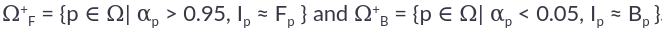
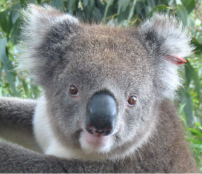
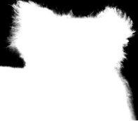
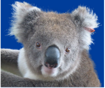
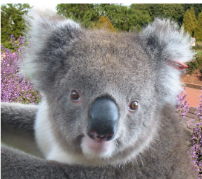
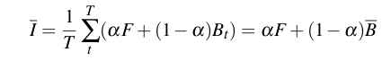
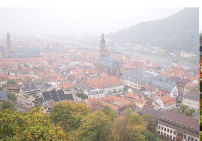
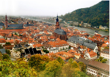

# Poisson Matting​(ID: 25)

## Github link 

### https://github.com/Digital-Image-Processing-IIITH/project-made-online

## Team Members 

#### Ansh Puvvada 2018102035

#### Avani Gupta 2019121004

#### Jayati Narang 2018101066

#### Kajal Sanklecha 2019801006

## Main Goal 

#### Matting for natural images in complex scenes by calculating the gradient of matte from image and solving Poisson equations.

## Problem Definition 

Image Matting in a natural image setting involving complex scenes is a challenging problem. We
tackle it using a semi-automatic approach relying on approximate matte from an image gradient
given a user-supplied trimap. We formulate the problem as Poisson matting: where the gradient matte field is approximated from image and image matte is solved using poison equations. We use global Poisson matting, a semi-automatic approach to approximate matte from
an image gradient given a user-supplied trimap. Global poisson matting fails to generate
a good matte in complex scenes. To combat it we introduce local Poison matting and manipulate
the continuous gradient field in a local region. The image gradients are visually distinguishable in
local regions and thus user's knowledge in the local gradient field can be exploited to get better
mattes.

### Image matting

Image matting in our setting refers to foreground extraction from any given image.
A new image can be blended from a background image and foreground image with its "alpha matte".
I = ɑ(x, y)* F (x, y) + (1 − ɑ(x, y)* B(x, y)     −  ( 1 )  
where ɑ(x, y) is the alpha matte of the given image, F(x, y) is the foreground image and B(x, y) is
the background image.
In natural image matting, all alpha, F and B need to be estimated.

### Poisson matting

We tackle the problem of natural image matting of complex scenes by solving Poisson equations
with the matte gradient field. Poisson matting generates good matting results on complex scenes
which are not possible with conventional matting technique.  

**Steps** 
##### 1. Approximating the gradient field of matte from the input image.
In order to approximate the gradient field of matte we take partial derivative on both sides of eq(i)  
       ∇I = (F - B)∇ɑ + ɑ∇F + (1 - ɑ)∇B   -- (2)   
where   
Equation (2) is taken for R, G, B channels separately.
When the foreground and background are smooth, the gradient field can be approximated

##### 2. Reconstructing matte by solving poisson equations

Equation (3) shows that matte gradient is proportional to the image gradient. Thus the matte can be reconstructed efficiently in 2D image space by solving poisson equations.

### Global poisson matting

The image is divided into three regions: definitely foreground ΩF, definitely background ΩB and “unknown” Ω. To recover matte for the unknown region, we minimize the following equation:
This is an Iterative optimization process as follows:
##### 1. (F - B) Initialization  
For each pixel in Ω, F and B are approximated by corresponding to nearest pixels in ΩF and ΩB​. The (F - B) image is then smoothened by a Gaussian filter.

##### 2. α reconstruction 
By solving the Poisson equation using current (F - B) and ∇I.
##### 3. F,B refinement 
Let   
   
Update Fp ​and Bp​ according to the color of nearest pixel in ​ and in .

Steps 2 and 3 are iterated until the change is sufficiently small.

### Local Poisson matting

Equation (2) can be rewritten as:

where 

When the background orforeground have strong gradients, global Poisson matting results ina poor quality mattes. A affects the matte gradient scale in that increasing A would sharpen boundaries. D is a gradient field caused by the background and foreground. Hence, we need to estimate A and D to approach the ground truth, A* and D*.

When the background or foreground have strong gradients, global Poisson matting results in a poor quality mattes. A few techniques have been developed to solve this. They are:
1. Poisson Matting in Local Region 
2. Local Operations  
       a) Channel Selection  
       b) Local Filtering  
       c) Refinement Process  

## Results 
We thus expect to generate a high quality image matte as shown in b). This matte can then be used to change the background of the image as shown in b, c.  
a)  b)   

c)  d)   

a) Original Image  
b) Matte generated using Poisson Matting  
c) Image with the extracted koala and a constant-colour background                                                                  
d) Image with a new background  

### Applications

#### Changing Backgrounds of complex natural images 
We can change the background of any image using our high quality matte generated by poisson matting.

#### Multi-background
Poisson matting can be applied to matting with multiple backgrounds by calculating the mean image of all backgrounds. Suppose we have T images I. The mean image is calculated as:

where Bt is Background of tth image. 
We expect poison matting to work better on multiple backgrounds.   

  

#### De-fogging (Implementation as a part of this project is tentative) 

   
The above images shows the de-fogging done on an image using Poisson matting.

### Milestones and Expected Timeline 

| Expected to complete by | Topics   |
| ------------- |:-------------:| 
| 31st October | Global Poisson Matting |
| 12th November | Local Poisson Matting |
| 18th November | Integration and testing, final deliverable |

### Dataset Details 

Natural images captured by smartphone camera by us.
No explicit dataset required for the problem.
